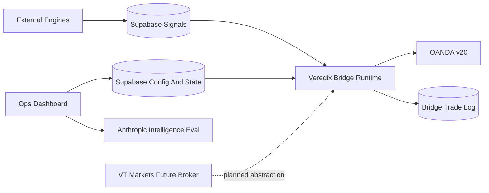

# Veredix Documentation

Veredix is the trading operations system built around the SignalForge Bridge. The current repository contains the bridge runtime, the internal dashboard, Supabase schema, OANDA execution client, AMD/regime intelligence services, and research scripts. Signal-generating engines write into Supabase; this repository consumes those signals, applies execution controls, and manages broker interaction.

## Reading Order

1. [PRD](./PRD.md) - product goals, operators, workflows, requirements, and launch criteria.
2. [System Architecture](./SYSTEM_ARCHITECTURE.md) - end-to-end data flow and ownership boundaries.
3. [Engine And Signal Logic](./ENGINE_AND_SIGNAL_LOGIC.md) - engine catalog, signal contract, risk pipeline, Omega, Rebuild, AMD, and regime logic.
4. [Bridge And Brokers](./BRIDGE_AND_BROKERS.md) - execution lifecycle, OANDA integration, monitoring, and VT Markets path.
5. [UI UX Spec](./UI_UX_SPEC.md) - dashboard routes, controls, user journeys, and interaction rules.
6. [Data Model Config And Migrations](./DATA_MODEL_CONFIG_AND_MIGRATIONS.md) - Supabase tables, config keys, RLS, env vars, and migrations.
7. [Operations And Runbook](./OPERATIONS_AND_RUNBOOK.md) - setup, daily operation, incidents, and research scripts.
8. [Platform Map](./PLATFORM_MAP.md) - live behavior snapshot, AMD tags, known issues, resolution status.
9. [Roadmap](./ROADMAP.md) - planned broker expansion, security hardening, UI cleanup, and open decisions.

## Source Of Truth

This documentation reflects the current repository behavior as of **July 2026 (bridge v1.2.0)**. For the July commit audit and ALPHAOMEGA/Lane B contract, start with:

- [CHANGELOG_July2026.md](../CHANGELOG_July2026.md)
- [ENGINE_ALPHAOMEGA_Reference_v1_0_0_July2026.md](../ENGINE_ALPHAOMEGA_Reference_v1_0_0_July2026.md)
- [OMEGA_LANE_B_ROLLOUT.md](../OMEGA_LANE_B_ROLLOUT.md)

It consolidates and updates scattered information from:

- `README.md`
- `SIGNALFORGE_BRIDGE_REFERENCE.md`
- `docs/BRIDGE_ARCHITECTURE.md`
- `docs/ENGINE_REBUILD.md`
- `docs/engine-rebuild-bar1-layer.md`
- `src/index.ts`
- `src/core/signalRouter.ts`
- `src/connectors/oanda.ts`
- `src/monitoring/tradeMonitor.ts`
- `src/services/AmdDetectorService.ts`
- `src/services/RegimeDetectorService.ts`
- `dashboard/app/*`
- `dashboard/components/*`
- `migrations/*.sql`

## Product Vocabulary

| Term | Meaning |
| --- | --- |
| Veredix | Product name for the full operations, execution, intelligence, and dashboard system. |
| SignalForge Bridge | Runtime service that consumes signals, applies controls, sizes positions, executes trades, and monitors outcomes. |
| Engine | External signal producer. Engines decide what to trade; the bridge decides whether and how to execute. |
| Signal | Row inserted into the Supabase `signals` table by an engine. |
| Bridge | The execution layer in this repository. It does not write source signals or engine outcomes. |
| Dashboard | Internal Next.js ops console on port 3001. |
| Shadow | Research or paper-trading tables that capture engine outcomes separate from live bridge execution. |
| AMD | Accumulation, Manipulation, Distribution daily intelligence for AUD_USD. |
| Regime | H4/D1 market state classifier used as advisory and audit context for Omega. |
| OANDA | Current live broker integration. |
| VT Markets | Parallel MT5 path for selected engines; still evolving toward a full broker abstraction. |
| Lane A | Omega on `oanda_practice` — RAW execution path. |
| Lane B / ALPHAOMEGA | Omega on `oanda_phase2_demo` — streak-crack entry and validated multi-exit stack. |

## Documentation Principles

- Current behavior wins over old docs when there is drift.
- Missing source-of-truth areas are marked as known gaps or open decisions.
- Broker credentials and secrets must never be documented as real values.
- Product requirements should distinguish shipped behavior, hidden WIP, and future roadmap.
- The docs are intentionally split by concern so each file can evolve without becoming a monolith.

## System Snapshot

## Known Documentation Gaps

- Engine runtime code is not fully contained in this repository.
- Shadow table schemas are referenced but not created by the main migration set.
- `migrations/` and `supabase/migrations/` have overlapping files; production canonical path should be confirmed.
- Dashboard README is stale compared with the current route map.
- Existing bridge reference docs contain drift around trailing stops, daily trade limits, and Rebuild bar1 sizing.
