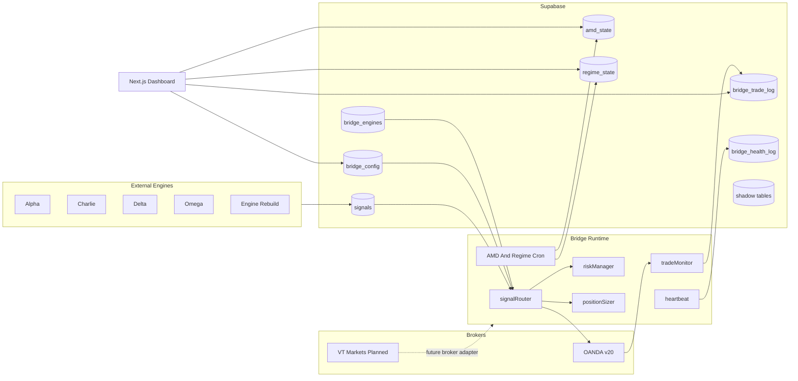
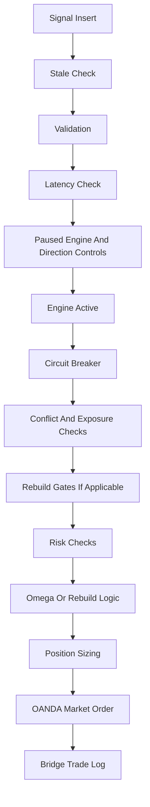

# System Architecture

## Overview

Veredix is split into external engines, Supabase state, the bridge runtime, broker APIs, dashboard UI, and research scripts. The bridge is the execution authority in this repository. Engines decide what to trade; the bridge decides whether to execute, how many units to send, how to manage the trade, and how to record the outcome.

## Context Diagram

## Runtime Ownership

| Layer | Owns | Does Not Own |
| --- | --- | --- |
| Engines | Signal generation, strategy logic, shadow outcome emission | Live OANDA execution decisions inside this repo |
| Supabase | Signal bus, config, logs, health, AMD/regime state | Secret storage for OANDA runtime credentials |
| Bridge | Validation, risk, sizing, execution, monitoring, intelligence cron | Source signal generation |
| OANDA connector | Current broker REST calls and candle fetches | Multi-broker routing |
| Dashboard | Operator control plane and review UI | Authentication, direct OANDA calls |
| Scripts | Backtests, audits, investigations, data backfills | Production runtime scheduling except npm scripts |

## Bridge Startup Flow

`src/index.ts` performs startup in this order:

1. Load env and Supabase client.
2. Load `bridge_config`.
3. Exit if `bridge_active=false`.
4. Load active rows from `bridge_engines`.
5. Retry OANDA account summary until reachable.
6. Initialize circuit breaker and peak equity.
7. Run startup reconciliation.
8. Start heartbeat and trade monitor intervals.
9. Schedule regime detection at H4 close plus five minutes.
10. Schedule AMD detection at 10:31 UTC daily.
11. Subscribe to `signals` inserts.
12. Subscribe to `bridge_engines` changes to refresh active engine roster.
13. Reset `trades_today` at UTC midnight.

## Signal Processing Flow

Every terminal decision is written to `bridge_trade_log` as `EXECUTED`, `BLOCKED`, `SKIPPED`, or `DEDUPLICATED`. Deduplication code currently exists but is disabled for testing in `signalRouter.ts`; docs and product expectations should not treat deduplication as active until restored.

## Dashboard Architecture

The dashboard is a Next.js 14 app in `dashboard/` running on port 3001. It uses `NEXT_PUBLIC_SUPABASE_URL` and `NEXT_PUBLIC_SUPABASE_ANON_KEY` to read/write Supabase directly from the browser. It does not have a login layer. The only server API route is `/api/intelligence-eval`, which calls Anthropic using `ANTHROPIC_API_KEY`.

Visible routes:

- `/` Overview
- `/activity`
- `/amd-history`
- `/calendar`
- `/health`
- `/intelligence`
- `/settings`

Hidden routes:

- `/omega` redirects to `/`
- `/rebuild` redirects to `/`

## Data Ownership

| Table | Writer | Reader |
| --- | --- | --- |
| `signals` | External engines | Bridge Realtime subscriber |
| `bridge_config` | Migrations, dashboard, AMD auto-direction | Bridge, dashboard |
| `bridge_engines` | Migrations, operator/admin updates | Bridge, dashboard |
| `bridge_trade_log` | Bridge, trade monitor, dashboard tags | Dashboard, scripts |
| `bridge_health_log` | Heartbeat | Dashboard |
| `bridge_brokers` | Migrations, heartbeat status updates | Dashboard |
| `amd_state` | AMD detector, override helpers | Dashboard, bridge Omega audit |
| `regime_state` | Regime detector | Dashboard, bridge Omega audit |
| Shadow tables | Engine or research processes | Dashboard hooks, backtests |

## Deployment Topology

The bridge deploys as a standalone Railway service using `railway.toml`:

- Build: `npm install && npm run build`
- Start: `npm start`
- Restart policy: on failure, max five retries

The dashboard is a separate Next.js app under `dashboard/`, run locally or deployed separately. It must point at the same Supabase project as the bridge.

## Architectural Constraints

- OANDA runtime credentials are env-only.
- `bridge_links` and `bridge_brokers` are schema-ready but not used for live broker routing.
- The bridge imports `src/connectors/oanda.ts` directly.
- Dashboard RLS grants anon read/update access to selected operational tables and config keys.
- AMD and regime services currently focus on `AUD_USD`.
- Rebuild logic is deeply integrated into `signalRouter.ts`, which is a legacy-sized file and should not be expanded for new features.

## Known Drift

- Older docs say trailing stops are not implemented; runtime has trail-stop support and `trail_stop_state`.
- Older docs say global trades/day is 24; current `riskManager.ts` uses 500.
- Rebuild docs describe bar1 multipliers like 2.0x and 0.25x; live code currently sets every bar1 multiplier to 1.0.
- Architecture docs mention `src/core/rebuildHelpers.ts`; logic currently lives in `signalRouter.ts` and specialized files such as `rebuildHourGate.ts` and `rebuildBoundsRetryOrder.ts`.
